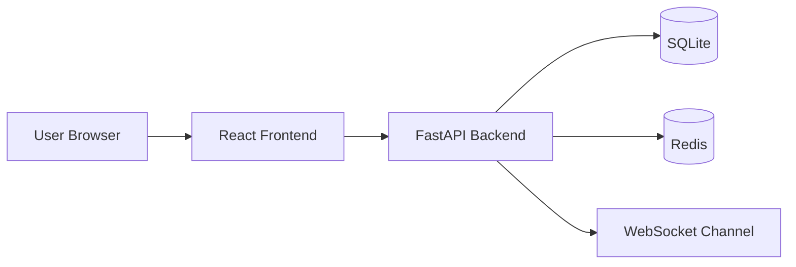
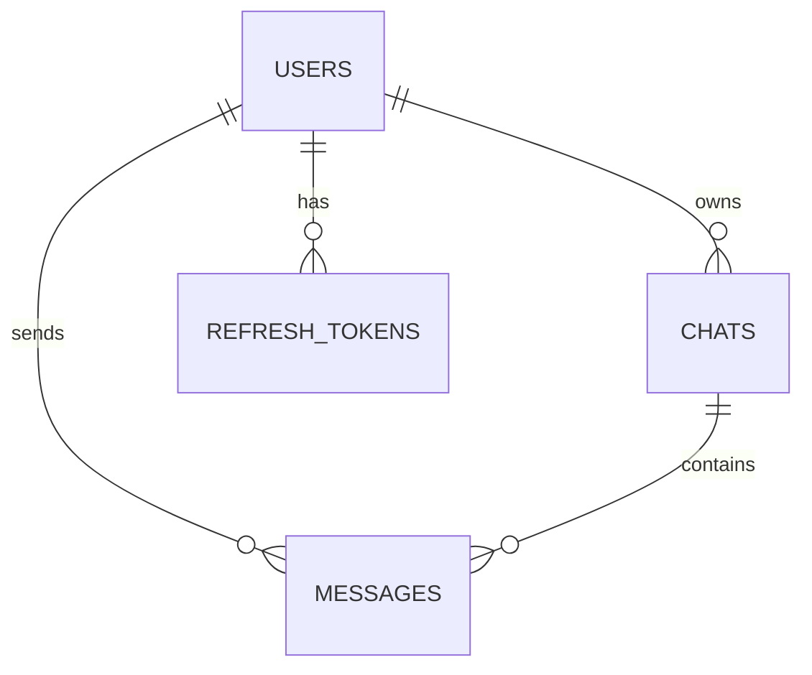
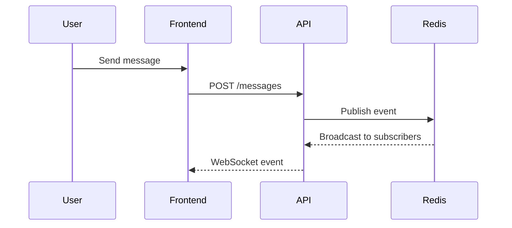

# Codec Chat

Codec Chat is a production-ready real-time chat application built with FastAPI, SQLAlchemy, WebSockets, Redis, React, TypeScript, and Tailwind CSS.

## Architecture Overview
- Backend: Python + FastAPI with layered services and repository-style separation
- Frontend: React + TypeScript + Vite + Tailwind CSS
- Persistence: SQLite in development, ready to migrate to PostgreSQL in production
- Messaging: WebSocket transport with Redis pub/sub for scaling and cross-instance communication

## Project Structure
- backend/app/authentication: auth controllers and security helpers
- backend/app/websockets: real-time connection handling
- backend/app/services: business logic
- backend/app/repositories: persistence abstractions
- backend/app/models: SQLAlchemy models
- backend/app/schemas: request and response schemas
- frontend/src/pages: application pages
- frontend/src/components: reusable UI components

## How to Run
1. Install backend dependencies: `pip install -r backend/requirements.txt`
2. Install frontend dependencies: `cd frontend && npm install`
3. Start the backend: `uvicorn app.main:app --reload --app-dir backend`
4. Start the frontend: `cd frontend && npm run dev`
5. Open http://localhost:5173

## Authentication
- Register via `/api/v1/auth/register`
- Login via `/api/v1/auth/login`
- Refresh tokens via `/api/v1/auth/refresh`

## WebSocket
- Connect to `ws://localhost:8000/ws/chat`

## Deployment
- Docker Compose for local orchestration
- Nginx configuration included
- Render/Railway/AWS deployment notes can be extended from this scaffold

## Testing
- Backend tests live under [backend/tests](backend/tests)
- Run with `pytest backend/tests`

## Mermaid Diagrams

### System Architecture

### ER Diagram

### Sequence Diagram

